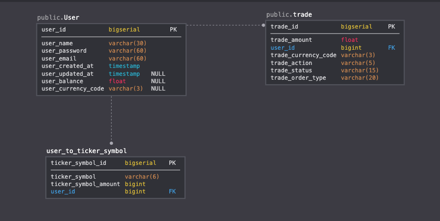

# Bulls vs. Bears Database Schema

This contains the PostgreSQL schema for Bulls vs. Bears.

## PSQL

To get started:

```bash
psql -d BvsB -U [user]
```

Some interesting flags (to see all, use `-h` or `--help` depending on your psql version):

- `-E`: will describe the underlaying queries of the `\` commands
- `-l`: psql will list all databases and then exit (useful if the user you connect with doesn't has a default database, like at AWS RDS)

Most `\d` commands support additional param of `__schema__.name__` and accept wildcards like `*.*`

- `\q`: Quit/Exit
- `\c __database__`: Connect to a database
- `\d __table__`: Show table definition (columns, etc.) including triggers
- `\d+ __table__`: More detailed table definition including description and physical disk size
- `\l`: List databases
- `\dy`: List events
- `\df`: List functions
- `\di`: List indexes
- `\dn`: List schemas
- `\dt *.*`: List tables from all schemas (if `*.*` is omitted will only show SEARCH_PATH ones)
- `\dT+`: List all data types
- `\dv`: List views
- `\dx`: List all extensions installed
- `\df+ __function__` : Show function SQL code. 
- `\x`: Pretty-format query results instead of the not-so-useful ASCII tables
- `\copy (SELECT * FROM __table_name__) TO 'file_path_and_name.csv' WITH CSV`: Export a table as CSV
- `\des+`: List all foreign servers
- `\dE[S+]`: List all foreign tables

User Related:

- `\du`: List users
- `\du __username__`: List a username if present.
- `create role __test1__`: Create a role with an existing username.
- `create role __test2__ noinherit login password __passsword__;`: Create a role with username and password.
- `set role __test__;`: Change role for current session to `__test__`.
- `grant __test2__ to __test1__;`: Allow `__test1__` to set its role as `__test2__`.
- `\deu+`: List all user mapping on server

## Database Schema


